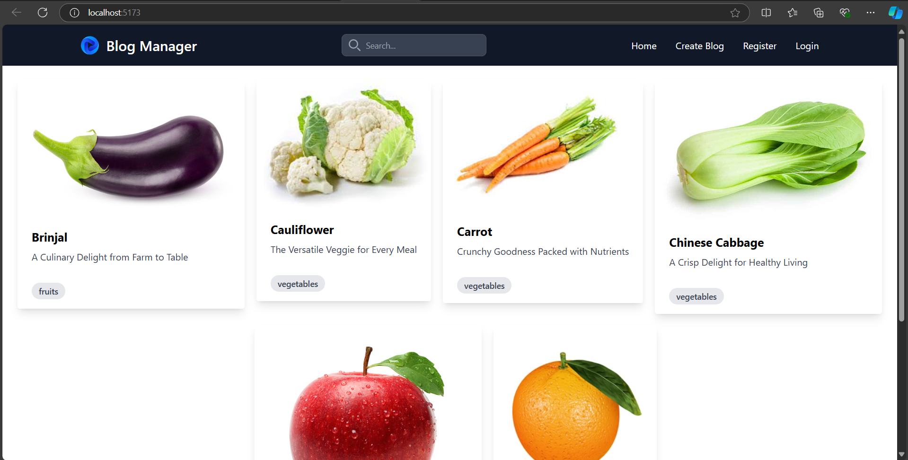
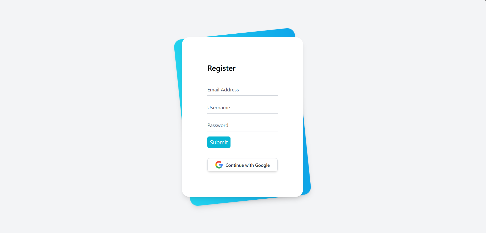
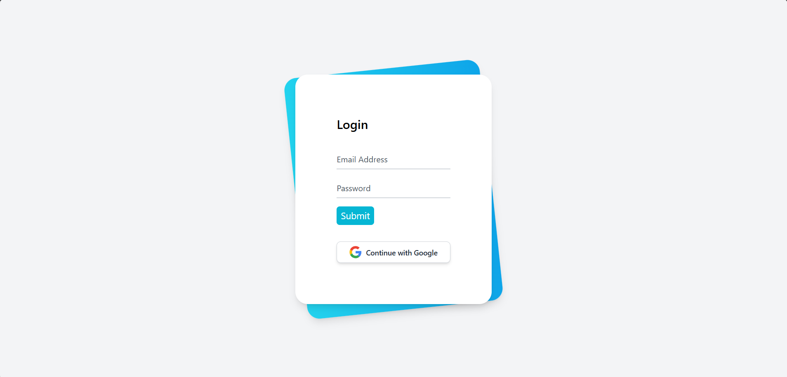
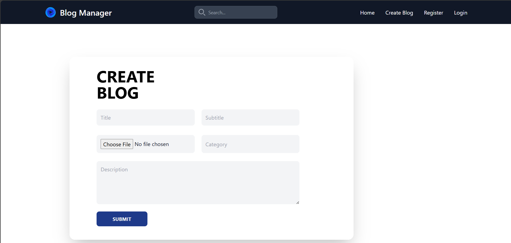

# BLOG-MANAGER

A complete blog manager website where users can read and manage blogs. The platform allows users to:

- View blogs on the homepage without logging in.
- Register an account and log in to access additional features.
- Create, edit, and delete blogs after logging in.
- Read full blog posts by clicking on the blogs.

## Features
- Home Page: Displays a list of all blogs. Users can click on any blog to read the full post.
- Authentication: Users can register and log in to access blog management features.
- Create Blog: Registered users can add new blog posts through a form after login.
- Public Access: Any user, logged in or not, can view blogs on the homepage.

 
## To visit this site, click [Here](https://blog-manager-eight.vercel.app/)
## To get API documentation, click [Here](https://documenter.getpostman.com/view/33322053/2sAXxPAYHJ)


## How to Run:

To run this locally, 
- Install code editors from [Here](https://code.visualstudio.com/download).
- Install NodeJs from [Here](https://nodejs.org/en/download/prebuilt-installer/current). 
- Clone this repo in (any folder) in your computer.
- Open that folder in VSCode. 
- create a Database in MongoDB from [Here](https://cloud.mongodb.com/)
- Connect the database with MongoDB
- Open command prompt and run following command 

### To install all the required dependencies of project :

```https
  cd frontend
```


```https 
  npm install
``` 
 ### To run the project :
```https 
  npm run dev
``` 


## Output :
  ### Home Page
  

  ### Register form
  

  ### Login form
  

  ### Create Blog form
  


## Feedback
  If you have any feedback, please reach out to me at yogendrabaskota18@gmail.com  


